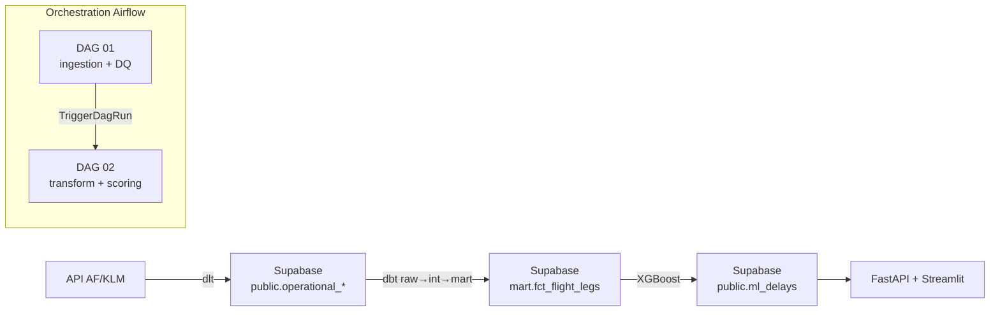

# RUNBOOK — Pipeline AFKLM Delay Prediction

Manuel d'exécution : de `git clone` à une prédiction de retard servie par l'API, en ~30 minutes.

Pour comprendre l'architecture en détail, voir [README.md](README.md).

---

## 1. Vue d'ensemble



Deux DAGs Airflow chaînés. Chaque étape écrit son état dans `logs.airflow_events` et `logs.pipeline_runs` sur Supabase, consommés par Grafana et Streamlit pour l'observabilité.

---

## 2. Prérequis

- **Docker Desktop** lancé (~5 GB RAM disponibles)
- **Projet Supabase** provisionné (URL `https://<projet>.supabase.co`, credentials Postgres)
- **Clé API AF/KLM** — [developer.airfranceklm.com](https://developer.airfranceklm.com), gratuite, quota 500 req/jour
- **Ports libres** sur la machine : 8081, 8501, 8000, 3000, 9090

---

## 3. Setup initial (à faire une seule fois)

### 3.1 Cloner le repo

```bash
git clone <URL_DU_REPO>
cd afklm-delay-pipeline
```

### 3.2 Remplir le `.env`

```bash
cp .env.example .env
```

Éditer `.env` — les 4 blocs à renseigner :

| Bloc | Variables | Où trouver |
|---|---|---|
| Supabase | `AFKLM_DB_HOST`, `AFKLM_DB_USER`, `AFKLM_DB_PASSWORD` | Supabase → Settings → Database → Connection string |
| API AFKLM | `AF_CLIENT_ID_1..5`, `SOURCES__AFKLM__API_KEY` | developer.airfranceklm.com (au moins `AF_CLIENT_ID_1` suffit) |
| Modèles ML | `MODEL_MEANS_URL`, `MODEL_SCALER_URL`, `MODEL_XGB_URL` | Supabase → Storage → `ml_models` → generate signed URL |
| Runtime | `ENV_TARGET=prod`, `DBT_TARGET=prod` | Cohérent = pointe sur Supabase (mettre `local` pour Postgres Docker) |

### 3.3 Bootstrap Supabase (schéma `logs`)

Une seule fois par projet Supabase :

1. Supabase → **SQL Editor** → nouvelle query
2. Coller le contenu de [`postgres_init/supabase_logs_bootstrap.sql`](postgres_init/supabase_logs_bootstrap.sql)
3. **Run**

Crée `logs.airflow_events` et `logs.pipeline_runs`. Idempotent : re-lançable sans risque.

### 3.4 Démarrer la stack

```bash
docker compose up -d --build
```

Premier boot : ~5 min (téléchargement images + install requirements). Les boots suivants : ~30s.

### 3.5 Vérifier le boot

```bash
docker compose ps
```

Attendu :
- 12 containers en état `Up`
- `afklm-formation-init` en état `Exited (0)` — **c'est normal**, service one-shot

```bash
docker exec afklm-formation-apiserver airflow connections list -o json \
  | python3 -c "import sys,json; print([c.get('conn_id') for c in json.load(sys.stdin)])"
```

Attendu : `['postgres_local', 'supabase_prd']` — les 2 connections Airflow sont auto-provisionnées par `airflow-init`.

---

## 4. Exécution d'un run (répétable)

### 4.1 Déclencher DAG 01 — Ingestion + Data Quality

**Ce qui se passe** : appel API AF/KLM pour la date cible, écriture d'environ 1400 vols dans Supabase (`public.operational_flights`, `operational_flight_legs`, `operational_flight_delays`), puis contrôles de qualité.

**Déclencheur** : Airflow UI ([http://localhost:8081](http://localhost:8081), login `admin`/`admin`) → activer le toggle `afklm_01_ingestion_data_quality` → bouton **Trigger DAG w/ config** :

```json
{"start_date": "2026-08-01", "end_date": "2026-08-01", "env_target": "prod"}
```

> Ajuster `start_date` / `end_date` à J+1 ou J+2 par rapport à la date d'exécution.
> La page Streamlit « Prédiction de vol » filtre automatiquement les dates passées ;
> sans vols futurs scorés, le sélecteur sera vide. L'API AF/KLM Operational Flights
> renvoie typiquement une fenêtre J-7 → J+3 ; au-delà de J+3 l'ingestion peut être vide.

**Durée typique** : ~7 min

**Vérification** : Grid View → 5 tasks vertes (`log_start_pipeline`, `afklm_el_dlt_pipeline`, `afklm_dq_verify_ingestion`, `log_success_pipeline`, `trigger_transformation_scoring`).

**Signal d'échec** : task rouge → clic → onglet **Logs** → chercher la stack trace. Cf. [Section 6](#6-incidents-courants).

### 4.2 DAG 02 s'enchaîne automatiquement

**Ce qui se passe** : `trigger_transformation_scoring` (task de fin du DAG 01) déclenche `afklm_02_transformation_scoring`, qui exécute `dbt run` (raw → int → mart) puis le scoring ML XGBoost sur les nouveaux vols.

**Déclencheur** : automatique. Rien à faire.

**Durée typique** : ~10 min

**Vérification** : dans l'UI Airflow, ouvrir `afklm_02_transformation_scoring` → dernier run → 6 tasks vertes (`log_start_transformation`, `afklm_t_dbt_run`, `afklm_t_dbt_test`, `afklm_ml_compute_predictions`, `afklm_ml_trigger_fastapi`, `log_success_transformation`).

### 4.3 Vérifier les données côté Supabase

Supabase → SQL Editor → 3 requêtes :

```sql
-- (a) Vols ingérés pour la date cible
SELECT COUNT(*) AS legs_ingered
FROM public.operational_flight_legs
WHERE ingested_at::date = CURRENT_DATE;
-- Attendu : > 1000

-- (b) Run pipeline en SUCCESS avec métriques
SELECT dag_id, status, duration_sec, vols_ingested, transformation_rows
FROM logs.pipeline_runs
ORDER BY started_at DESC LIMIT 2;
-- Attendu : DAG 01 SUCCESS (vols_ingested > 0), DAG 02 SUCCESS (transformation_rows > 0)

-- (c) Prédictions ML générées
SELECT COUNT(*) AS predictions
FROM public.ml_delays
WHERE created_at::date = CURRENT_DATE;
-- Attendu : > 10 000 (une prédiction par vol scoré)
```

### 4.4 Consommer les prédictions

- **Streamlit** [http://localhost:8501](http://localhost:8501) → page **Analyses des retards constatés** → filtrer sur la date métier
- **FastAPI** [http://localhost:8000/docs](http://localhost:8000/docs) → endpoint `/predict` → tester avec un `leg_id` récent

---

## 5. UIs disponibles

| Service | URL | Login | Rôle |
|---|---|---|---|
| Airflow | http://localhost:8081 | admin/admin | Trigger et suivi des DAGs |
| Streamlit | http://localhost:8501 | — | Dashboards retards + observabilité pipeline |
| FastAPI | http://localhost:8000/docs | — | API prédictions (Swagger UI) |
| Grafana | http://localhost:3000 | admin/admin | Métriques Prometheus + graphes `pipeline_runs` |
| Prometheus | http://localhost:9090 | — | Cibles scrape + alertes brutes |

---

## 6. Incidents courants

### Task rouge dans DAG 01

Ouvrir la task → onglet **Logs**. Signatures fréquentes :

| Erreur observée | Cause | Fix |
|---|---|---|
| `401 Unauthorized` sur `afklm_el_dlt_pipeline` | Clé API AFKLM invalide/expirée | Régénérer `AF_CLIENT_ID_1` dans `.env` → `docker compose restart scheduler dag-processor` |
| `SSL handshake failed` sur `afklm_dq_verify_ingestion` | Credentials Supabase invalides | Vérifier `AFKLM_DB_*` dans `.env` |
| `The conn_id 'supabase_prd' isn't defined` | Connection Airflow manquante | `docker compose run --rm airflow-init` (re-provisionne) |
| `[monitoring] log_event persist failed` avec stack trace | Le monitoring n'a pas pu écrire dans Supabase — la task métier a réussi mais aucun event dans `logs.*` | Suivre la stack trace : 99% du temps c'est une connection cassée |

### Task rouge dans DAG 02

Vérifier d'abord que DAG 01 est bien allé jusqu'au bout — DAG 02 dépend de tables créées par dbt lors du run précédent.

| Erreur | Cause |
|---|---|
| `relation "public_nart.fct_flight_legs" does not exist` | `afklm_t_dbt_run` n'a jamais tourné avec succès — vérifier que DAG 01 est vraiment vert bout-en-bout |
| `signed URL expired` sur `afklm_ml_compute_predictions` | Les `MODEL_*_URL` du `.env` ont expiré (URLs signées Supabase Storage) → régénérer côté Supabase |
| `Version mismatch` (warning) sur XGBoost/sklearn | Non bloquant. Signal que les modèles ont été picklés avec une ancienne version — à re-entraîner à terme |

### Airflow vert mais Supabase silencieux (`logs.*` vides)

Symptôme historique du monitoring silencieux (résolu depuis, mais bon à connaître) :
1. Chercher dans les logs Airflow : `[monitoring]` ou `persist failed`
2. La stack trace pointera la vraie cause (JSON non sérialisable, connection cassée, permissions Supabase)

---

## Annexe — Arrêter / relancer la stack

```bash
# Arrêt propre (conserve les données Airflow metadata + Postgres local)
docker compose stop

# Redémarrage (rapide, ~30s)
docker compose start

# Wipe complet metadata Airflow + Postgres Docker local (Supabase reste intact)
docker compose down -v
```
